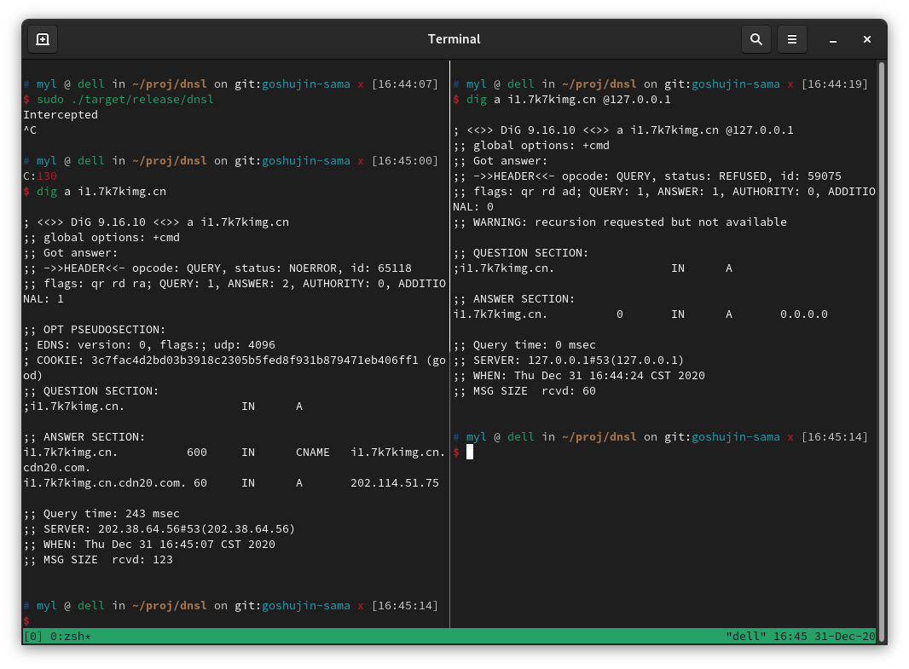

# Implementation

`dnsl` is written in Rust, with latest Rust async utils to use coroutines,
containing following modules in `src` folder:

- `error.rs`: Gerneric `Error` & `Result`, used for error handling;
- `config.rs`: Load env and config file;
- `models/`: Model definations, including `Msg` (message), `QD` (question), and `RR` (resource record);
- `tasks/`: Task spawning, including 3 tasks: `listen`, `lookup`, and `reply`.

As for other folders and files:

- `tests/`: Integrated test scripts;
- `assets/`: Currently containing test fixtures;
- `route`: Example config file;
- `.github/workflows/`: GitHub Action CI config;
- `docs/`: Documentations.

## Work flow

The program starts from `main.rs`.
`main.rs` only import `entry()` from `lib.rs` and run it with
[`tokio`]('https://github.com/tokio-rs/tokio') runtime.
It enables the program to use `tokio`-related async utils, and runs the top level async function.

In `lib.rs`, `entry()` will acquire and bind required 2 sockets.
One is `listen_sock` (sock abbr. socket), to communicate with clients,
the other is `lookup_sock`, to communicate with the upstream server.

Then `entry()` will load config with utils in `config.rs`.
It will build up a HashMap `route` to store the relations between questions and answers.

Finally `entry()` will use the exported function `spawn_tasks()` from `tasks/mod.rs` to spawn 3 tasks.

Let us see the `spawn_tasks()` in `tasks/mod.rs`.
It takes the 2 sockets and HashMap for routing, use `tokio` `spawn()` to spawn 3 coroutines.
More detailed description about coroutines could be found on
[Wikipedia](https://en.wikipedia.org/wiki/Coroutine) and
[Stackoverflow](https://stackoverflow.com/questions/553704/what-is-a-coroutine).
You can barely see it as threads, but the threads are controlled by programmers.

Then `spawn_tasks()` will also create a `mpsc` (mpsc abbr. multi-producer-single-consumer) channel
for the tasks to communicate with each other.

And `spawn_tasks()` will create a HashMap `query_map` to store question/answer ID with the client address.
It will be passed to 3 tasks to allow them to share states.

Finally, `spawn_tasks()` will wait (but with async `await`) on the 3 tasks to exit,
which means waiting forever.

Now let us see the spawned 3 tasks.
`listen_task` in `tasks/listen.rs` is the most complicated one.
It listens on `listen_sock` for questions.
As sockets are full-duplex, and only `listen_task` can receive on it,
the listening is lock-free.
Once it receives a question, `listen_task` parses it as a `Msg`, which defined in `models/msg.rs`.
Without breaking the binary format of buffer, `listen_task` can read some fields defined in RFC 1035.
It inserts the question ID into the HashMap `query_map` with the client UDP address.
As `query_map` may also be accessed by `reply_task`, here it takes a mutex.
And then check if the question should be intercepted with another HashMap `route`.
If yes, it will generate the answer, and passes the answer to the `mpsc` channel with its sender.
If no, it will forward the question, use `lookup_sock` to send it to the upstream server.
As `listen_task` is the only one that is able to send on `listen_sock`, here is also lock-free.

As for `lookup_task` in `tasks/lookup.rs`, what it does is simple: it only listens on `lookup_sock`,
and forwards the reply from the upstream server to the `mpsc` channel with its sender.
The listening is also lock-free.

And for `reply_task`, it is the only consumer of the `mpsc` channel, receives all answers with `mpsc` recipient. Then it fetches the answer ID in `query_map`, to get the client address it should reply to.
Finally it uses `listen_sock` to reply to the client, which is lock-free.

## Examples

If we use the example route file `route`, we will get:

If the question should be intercepted:

If the question should be local resolved:

If the question should be relayed/forwarded:

